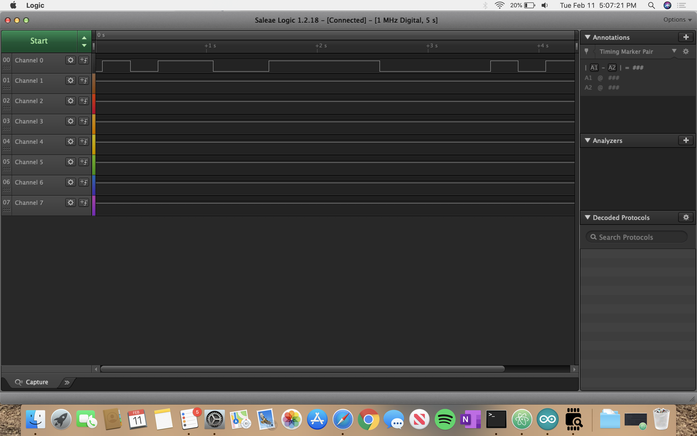
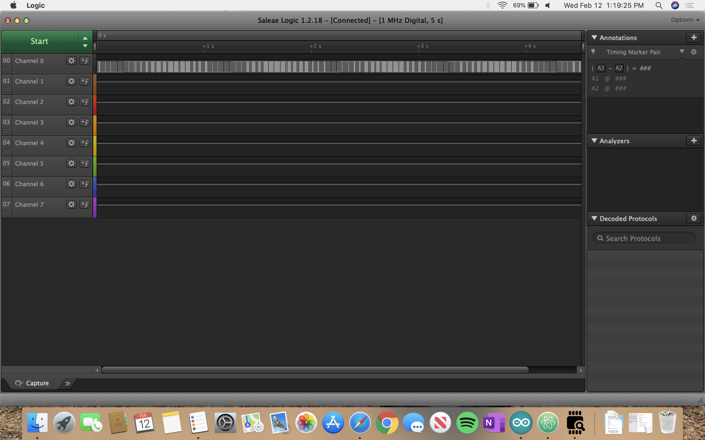
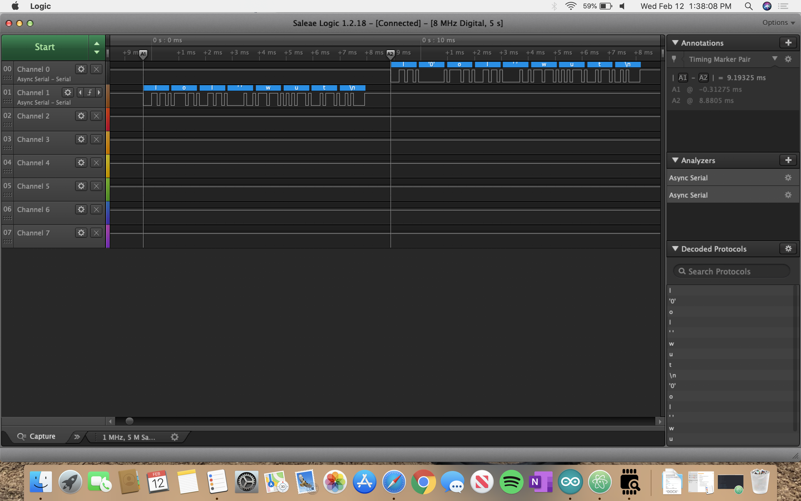
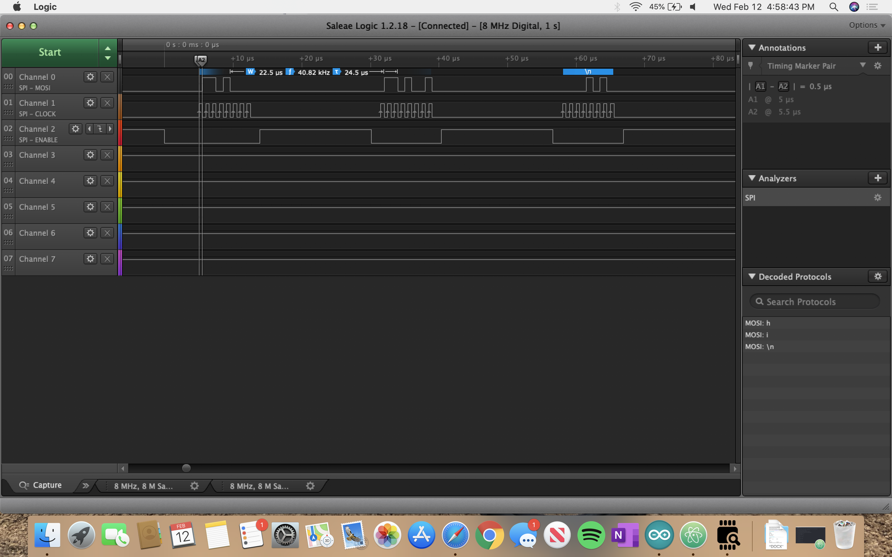

Name: Adrian Hinojosa

EID: afh663

Team Number: 7

## Questions

1. Why does your program need a setup and a loop?

    This computer is typically used for functions that would just run on repeat for extended periods of time so the device needs to know what to run once for initialization and then what to run indefinitely.

2. What is the downside to putting all your code in a loop?

    Putting all of your code in a loop means that you will be initializing values that might not be changing, sacrificing speed and possibly storage, as well can make your code cluttered and hard to read.

3. Why does your code need to be compiled?

    Compiling the code turns the code from the program's language into binary as well as clears and loads the ROM.

4. When lowering the frequency in procedure A, step 4, what is going wrong? Brainstorm some solutions. Dimmers exist in the real world. What is their solution?

    We can't see the blinking above a certain frequency so it looks like a solid light that is at different brightnesses.

5. Why do you need to connect the logic analyzer ground to the ESP32 ground?

    The logic analyzer needs a reference for the voltage.

6. What is the difference between synchronous and asynchronous communication?

    Synchronous matches all devices to a single clock cycle but asynchronous does not.

7. Profile of UART: Sent X bytes in Y time

    8 bytes in 9.19ms = .8705 B/ms

8. Profile of SPI: Sent X bytes in Y time

    3 bytes in 59.125 microsecs = .0507 b/microsec

9. Why is SPI so much faster than UART?

    It's so much faster because it's synchronous.

10. list one pro and one con of UART

    Because UART is asynchronous, it does not have to be connected to or wait for the clock. But the con is that it is so slow.

11. list one pro and one con of SPI

    One pro of SPI is its incredible speed, but the downside is that you have to monitor more connections (3+).

12. list one pro and one con of I2C

      One pro of I2C is that slave devices can be connected in series instead of connecting each device to the hub directly. One con is that is that it has open drain.

13. Why does I2C need external resistors to work?

    The resistors control power draw.

## Screenshots

Procedure A, step 1:

Procedure A, step 4:

Procedure B, UART:

Procedure B, SPI:

